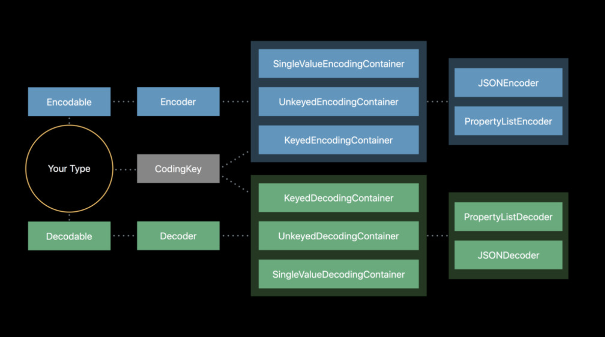

# Codable

- JSONSerialization, PropertyListSerialization 등을 대신하여 편하게 사용할 수 있음

- `Decodable`과 `Encodable`을 하나로 합친 것

  ```swift
  public typealias Codable = Decodable & Encodable
  ```

<p align="center">
  
</p>

> **Decoder로부터 생성하는 Container**
>
> - `KeyedDecodingContainer` : Dictionary 형태
> - `UnkeyedDecodingContainer` : Array 형태
> - `SingleValueDecodingContainer` : 단일값(잘 사용되지 않는다.)

### Encoding & Decoding

- Encoding : 부호화
  - 정보를 목적에 맞는 다른 형태나 형식으로 변환하는 처리 방식. **Data로 변환**
  - `plist`, `struct`, `class`, `JSON`, `File`, `Array` => `Data`
- Decoding : 복호화
  - Encoding한 데이터를 원래 형태로 되돌리는 것. **Data를 복원**
  - `Data` => `plist`, `struct`, `class`, `JSON`, `File`, `Array`

## Usage

- `Codable` protocol을 채택하기만 하면 간단하게 사용 가능
- Bulit-in Encoder / Decoder와 함께 사용
  - 데이터 형식에 따라 다른 Decoder를 사용
  - `PropertyListEncoder`, `PropertyListDecoder` => XML 형식
  - **`JSONEncoder`, `JSONDecoder` => JSON 형식**

### Encoder

```swift
struct MacBook: Codable {
  let model: String
  let modelYear: Int
  let display: Int
}

let macBook = MacBook(
  model: "MacBook Pro", modelYear: 2018, display: 15
)

// Encode
if let encodedData = try? JSONEncoder().encode(macBook) {
  print(encodedData)
}
```

### Decoder

```swift
let jsonData = """
{
  "model": "MacBook Pro",
  "modelYear": 2018,
	"display": 15,
}
""".data(using: .utf8)!
 
// Decode. Data 타입(jsonData)을 MacBook 타입으로 변환
if let decodedData = try? JSONDecoder().decode(MacBook.self, from: jsonData) {
  print(decodedData)
} 
```

## Implementation

### Auto-Synthesis by Compiler

- Custom type에 `Codable`을 채택하면 컴파일러에 의해 encode / decode 코드를 자동으로 생성한다

  ```swift
  struct User: Codable {
    var userName: String
    var score: Int
    
    // ⬇︎ Auto Synthesis Code ⬇︎
    
    @derived private enum CodingKeys: String, CodingKey {
      case userName
      case score
    }
    
    // Decode
    @derived init(from decoder: Decoder) throws {
      // CodingKeys에서 정의한 case를 key에 매칭시켜서 parsing
      let container = try decoder.container(keyedBy: CodingKeys.self)
      userName = try container.decode(String.self, forKey: .userName)
      score = try container.decode(Int.self, forKey: .score)
    }
    
    // Encode
    @derived func encode(to encoer: Encoder) throws {
      var container = encoder.container(keyedBy: CodingKeys.self)
      try container.encode(userName, forKey: .userName)
      try container.encode(score, forKey: .score)
    }
  }
  ```

  > **Coidng Keys**
  >
  > - `struct`의 property를 Encoding과 Decoding을 위한 key로 사용하기 위해 쓰이는 protocol
  > - 변수 이름을 json data의 key 이름과 매칭시킴
  > - Key의 타입(일반적으로 `String`)과 `CodingKey` protocol을 conform해서 구현

### Manual Implementation

- 다음 경우에 `Codable` 을 직접 구현할 수 있다
  - 변수 이름을 JSON data의 key 이름과 다르게 사용하는 경우
  - 중첩된 JSON에서 필요한 key만 꺼내서 사용하는 경우
  - 기본 구현되는 기능 외에 다른 구현이 필요한 경우

### Change Key Names

- `Decodable`을 사용해서 parsing할 때, `CodingKeys`의 `rawValue`를 JSON data의 key 이름이 같다고 간주하고 parsing을 시도함
- 두 이름이 서로 다른 경우 직접 `CodingKeys`를 구현해서 `rawValue`를 JSON data의 key 이름으로 변경해야함

```swift
let jsonData = """
{
  "user_name": "James",
  "user_email": "abc@xyz.com",
  "gender": "male",
}
""".data(using: .utf8)!

struct User: Decodable {
  let name: String
  let email: String
  let gender: String
  
  enum CodingKeys: String, CodingKey {
    case name = "user_name"
    case email = "user_email"
    case gender
  }
}

// Decode
if let user = try? JSONDecoder().decode(User.self, from: jsonData) {
  print(user)
}
```

### Nested Keys

- JSON data에서 key에 대한 value가 일반 타입이 아닌 JSON 형태의 데이터일 수 있다

- **Nested Codable** : JSON 형식의 value가 dictionary item을 갖는 array인 경우 `Decodable`을 conform하는 별도의 `struct`를 이용해 `Codable` 객체의 collection을 표현

  ```swift
  let jsonData = """
  {
    "message": "success",
    "number": 3,
    "people": [
      { "craft": "ISS", "name": "Anton Shkaplerov" },
      { "craft": "ISS", "name": "Scott Tingle" },
      { "craft": "ISS", "name": "Norishige Kanai" },
    ]
  }
  """.data(using: .utf8)!
  
  struct Astronauts: Decodable {
    let message: String
    let number: Int
    let people: [Person]
    
    struct Person: Decodable {
      let name: String
    }
  }
  
  // Decode
  if let astronauts = try? JSONDecoder().decode(Astronauts.self, from: jsonData) {
    print("message: ", astronauts.message)
    print("number: ", astronauts.number)
  	astronauts.people.forEach { print($0) }
  }
  ```

- **Nested Keys 적용** : JSON value가 dictionary일 때, value가 갖는 key를 상위 level에서 parsing할 수 있도록 `init(from:) throws`에서 parsing code를 직접 구현

  ```swift
  let jsonData = """
  [
  {
    "latitude": 30.0,
    "longitude": 40.0,
    "additionalInfo": {
      "elevation": 50.0,
    }
  },
  {
    "latitude": 60.0,
    "longitude": 120.0,
    "additionalInfo": {
      "elevation": 20.0
    }
  }
  ]
  """.data(using: .utf8)!
  
  struct Coordinate {
    var latitude: Double
    var longitude: Double
    var elevation: Double
  
    enum CodingKeys: String, CodingKey {
      case latitude
      case longitude
      case additionalInfo
    }
    
    // 다른 level에 있는 key에 대해서도 codingKeys 구현
    enum AdditionalInfoKeys: String, CodingKey {
      case elevation
    }
    
    // Decode
    init(from decoder: Decoder) throws {
      let values = try decoder.container(keyedBy: CodingKeys.self)
  		latitude = values.decode(Double.self, forKey: .latitude)
      longitude = values.decode(Double.self, forKey: .longitude)
      
      // Parsing Nested Keys
      // additionalInfo의 value가 dictionary
      // Nested dictionary를 nestedContainer로 가져와서 key에 접근해야함
      let additionalInfo = try values.nestedContainer(
        keyedBy: AdditionalInfoKeys.self,
        forKey: .additionalInfo
      )
      elevation = try additionalInfo.decode(Double.self, forKey: .elevation)
    }
    
    // Encode
    func encode(to encoder: Encoder) throws {
      var container = encoder.container(keyedBy: CodingKeys.self)
      try container.encode(latitude, forKey: .latitude)
      try container.encode(longitude, forKey: .longitude)
      
      // Encoding for nested dictionary keys
      var additionalInfo = container.nestedContainer(
        keyedBy: AdditionalInfoKeys.self,
        forKey: .additionalInfo
      )
      elevation = try additionalInfo.decode(Double.self, forKey: .elevation)
    }
  }
  ```


## Error

- Encoding 및 Decoding에 실패했을 때 `catch`로 받을 수 있는 error

- Encoding Error

  ```swift
  public enum EncodingError: Error {
    // 주어진 값으로 인코딩을 하지 못할 때
    case invalidValue(Any, EncodingError.Context)
  }
  ```

- Decoding Error

  ```swift
  public enum DecodingError: Error {
    // Property type mis match
  	case typeMismatch(Any.Type, DecodingError.Context)
    // Decoding할 데이터의 key에 해당하는 value가 없을 경우
    case valueNotFound(Any.Type, DecodingError.Context)
    // Decoding할 데이터에 지정한 key가 없는 경우
    case keyNotFoundd(CodingKey, DecodingError.Context)
    // 데이터가 망가졌을 경우
    case dataCorrupted(DecodingError.Context)
  }
  ```

  

