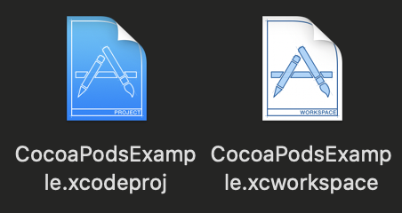

# Dependency Manager

- 외부 라이브러리를 관리하는 tool
  - [CocoaPods](https://cocoapods.org)
  - [Carthage](https://github.com/Carthage/Carthage)
  - [Swift Package Manager](https://github.com/apple/swift-package-manager)
- 외부 라이브러리를 사용할 때는 버전 지원이 얼마나 잘 이루어지는지 확인하고 사용해야 한다.

## CocoaPods

- Swift & Objective-C Cocoa Project를 위한 라이브러리들의 의존성 관리자(Dependency Manager)
  
  - Github : https://github.com/CocoaPods/CocoaPods
- Page : `https://cocoapods.org`
  
- Cocoapods는 라이브러리의 코드만 내려받은 다음 매번 빌드하기 때문에 라이브러리 설치 속도는 빠르지만 빌드하는 시간이 오래걸린다. 

- CocoaPods를 설치한 프로젝트는 기존 `*.xcodeproj` 대신 **`*.xcworkspace`**로 프로젝트를 실행해야함

  

### How to Use

- Pod Init

  ```shell
  $ sudo gem install cocoapods
  ```

- Edit `Podfile`

  ```shell
  $ pod init		# Podfile 생성
  $ vi Podfile
  
  ### Edit Podfile ###
  
  target 'CocoaPodsExample' do
  	use_frameworks!
  	pod 'SnapKit'	# 사용할 라이브러리 작성
  end
  
  #####################
  ```

- Pod Update(Optional)

  ```shell
  $ pod repo update
  ```

- Install library

  ```shell
  $ pod install
  ```

## Carthage

- Github : https://github.com/Carthage/Carthage
- Carthage는 최초 설치할 때 라이브러리를 빌드해 놓기 때문에 Cocoapods에 비해 라이브러리 최초 설치 및 버전 업데이트 속도는 느리지만 빌드 시간이 빠르다.
- 라이브러리가 빌드된 상태(binary)로 오기 때문에 원래 코드를 볼 수 없다.

### How to Use

- Install Carthage

  ```shell
  $ brew update							# Homebrew 버전 update
  $ brew install carthage		# Carthage 설치
  $ brew upgrade carthage		# 이미 설치된 carthage 버전 update
  ```

- Edit `Cartfile`

  - Carthage는 github에 직접 접근하기 때문에 `{username}/{repository name}`으로 작성

  ```shell
  $ vi Cartfile
  
  ### Edit Cartfile ###
  
  github "Alamoffire/Alamofire"
  github "onevcat/Kingfisher"
  github "SnapKit/SnapKit"
  
  #####################
  ```

- Install Library

  ```shell
  $ carthage update									# 전체 update
  $ carthage update --platform iOS	# iOS platform 한정 update
  $ carthage update Alamofire				# 특정 라이브러리를 지정해서 update
  ```

- Add libraries

  - Project Settings - [Build Phase] - [Link Binary With Libraries] - [Add Files]
  - Open [Carthage] - [Build] - [iOS] - [{Library Name}.framework]

- Add Run Script

  - [Build Phase] - [New Run Script Phase]

  - Xcode를 실행할 때 실행될 script를 작성하는 것

  - Shell Script 작성

    ```shell
    /usr/local/bin/carthage copy-frameworks
    ```

  - Add Input Files

    ```
    $(SRCROOT)/Carthage/Build/iOS/{Library Name}.framework
    ```

## OpenSources

- [SnapKit](https://github.com/SnapKit/SnapKit)
- [Animated Tab Bar](https://github.com/Ramotion/animated-tab-bar)
- [Alamofire](https://github.com/Alamofire/Alamofire)