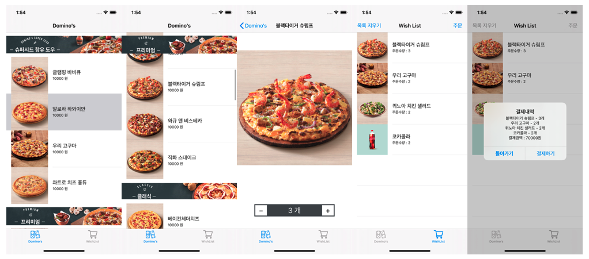
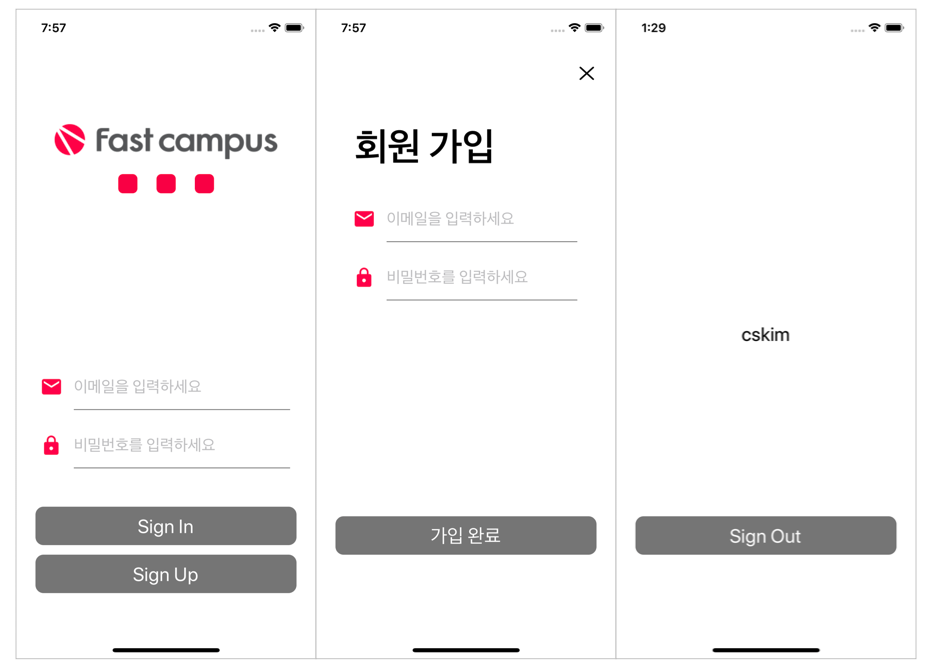
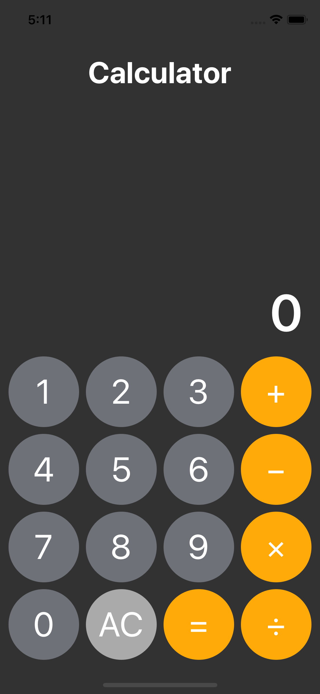
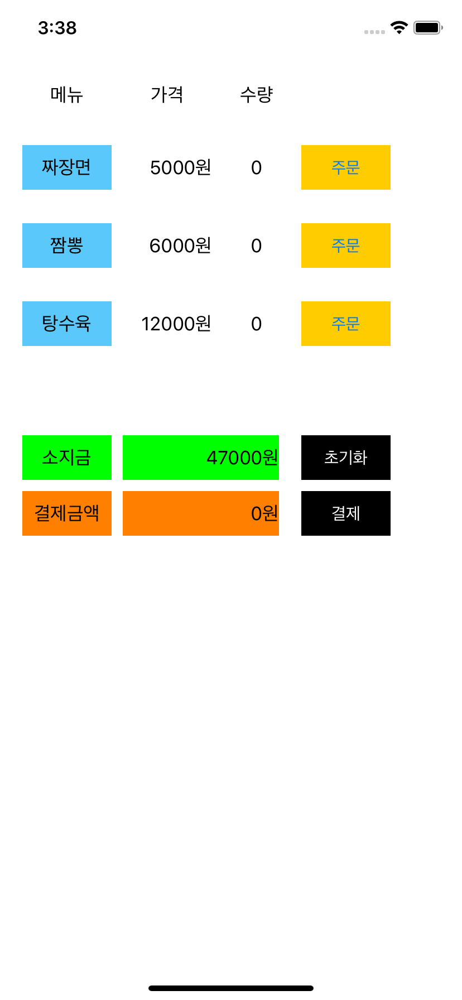

#  iOS Study Log

📝 Daily iOS Study Log in FastCampus iOS School 10th

## Table of Contents

- [Study](https://github.com/cskime/ios-TIL#Study-Log)
- [Tasks](https://github.com/cskime/ios-TIL#Tasks)
  - Domino Order
  - Basic Calculator
  - Basic Login Page
  - Simple Order

## Study Log

| Week        | Date     | Subjects                                                     |
| :---------- | :------- | ------------------------------------------------------------ |
| **Week 1**  | 19.11.04 | [컴퓨터 개론](https://github.com/cskime/ios-school/blob/master/201911/1주차/191104/[1-1]191104_컴퓨터개론.md) |
|             | 19.11.05 | [Git](https://github.com/cskime/ios-school/blob/master/201911/1주차/191105/[1-2]191105_Git.md) [Terminal](https://github.com/cskime/ios-school/blob/master/201911/1주차/191105/[1-2]191105_Terminal.md) |
|             | 19.11.08 | [Swift Basic: Operator, Type](https://github.com/cskime/ios-school/blob/master/201911/1주차/191108/[1-5]191108_Swift-Basic.md) [Function](https://github.com/cskime/ios-school/blob/master/201911/1주차/191108/[1-5]191108-function.md) |
| **Week 2**  | 19.11.11 | [Flow Control](https://github.com/cskime/ios-school/blob/master/201911/2주차/191111/[2-1]191111_흐름제어.md) |
|             | 19.11.12 | [Github](https://github.com/cskime/ios-school/blob/master/201911/2주차/191111/[2-1]191111_Github.md) & [Git Flow(co-working)](https://github.com/cskime/ios-school/blob/master/201911/2주차/191112/[2-2]191112_Github협업.md) |
|             | 19.11.13 | [Collection: Array](https://github.com/cskime/ios-TIL/blob/master/201911/2%EC%A3%BC%EC%B0%A8/191113/%5B2-3%5D191113_CollectionType_Array.md) [Collection: Set](https://github.com/cskime/ios-TIL/blob/master/201911/2%EC%A3%BC%EC%B0%A8/191113/%5B2-3%5D191113_CollectionType_Set.md) [Collection: Dictionary](https://github.com/cskime/ios-TIL/blob/master/201911/2%EC%A3%BC%EC%B0%A8/191113/%5B2-3%5D191113_CollectionType_Dictionary.md) [Tuple](https://github.com/cskime/ios-school/blob/master/201911/2주차/191111/[2-1]191111_Tuple.md) |
|             | 19.11.14 | [Optional](https://github.com/cskime/ios-TIL/blob/master/201911/2주차/191114/[2-4]191114_Optional.md) [Enumeration](https://github.com/cskime/ios-TIL/blob/master/201911/2주차/191114/[2-4]191114_Enumerations.md) |
|             | 19.11.15 | [Closure](https://github.com/cskime/ios-TIL/blob/master/201911/2주차/191115/[2-5]191115_Closure.md) |
| **Week 3**  | 19.11.18 | [OOP and Class Basic](https://github.com/cskime/ios-TIL/blob/master/201911/3주차/191118/[3-1]191118_OOP와_Class.md) |
|             | 19.11.19 | [OOP의 4대 특성](https://github.com/cskime/ios-TIL/blob/master/201911/3주차/191119/[3-2]191119_OOP_4대특성.md) [Access Control](https://github.com/cskime/ios-TIL/blob/master/201911/3주차/191119/[3-2]191119_Class_Access_Control.md) |
|             | 19.11.21 | [App Life Cycle](https://github.com/cskime/ios-TIL/blob/master/201911/3주차/191121/[3-4]191121_App_Lifecycle.md) [Xcode: SceneDelegate and AppDelegate](https://github.com/cskime/ios-TIL/blob/master/201911/3주차/191121/[3-4]191121_Xcode_Project.md) |
|             | 19.11.22 | [UIGuide: Point vs. Pixel, Frame vs. Bounds](https://github.com/cskime/ios-TIL/blob/master/201911/3주차/191122/[3-5]191122_UIGuide.md) |
| **Week 4**  | 19.11.25 | [UIViewController](https://github.com/cskime/ios-TIL/blob/master/201911/4주차/191125/[4-1]191125_UIViewController.md) [Modal Presentation](https://github.com/cskime/ios-TIL/blob/master/201911/4주차/191125/[4-1]191125_Modal_Presentation.md) [UIViewContentMode](https://github.com/cskime/ios-TIL/blob/master/201911/3주차/191122/[3-5]191122_UIViewContentMode.md) |
|             | 19.11.26 | [UIAlertController](https://github.com/cskime/ios-TIL/blob/master/201911/4주차/191126/[4-2]191126_UIAlertController.md) [UITextField](https://github.com/cskime/ios-TIL/blob/master/201911/4주차/191126/[4-2]191126_UITextField.md) |
|             | 19.11.29 | [1차 시험: Simple Order](https://github.com/cskime/ios-TIL/tree/master/Tasks/TEST1-Order) |
| **Week 5**  | 19.12.03 | [Storyboard Segueway](https://github.com/cskime/ios-TIL/blob/master/201912/5주차/191203/[5-2]191203_Segue.md) |
|             | 19.12.05 | [Initializer](https://github.com/cskime/ios-TIL/blob/master/201912/5주차/191205/[5-4]191205_Initializer.md) [Type Casting](https://github.com/cskime/ios-TIL/blob/master/201912/5주차/191205/[5-4]191205_TypeCasting.md) |
|             | 19.12.06 | [UserDefaults](https://github.com/cskime/ios-TIL/blob/master/201912/5주차/191206/[5-5]191206_UserDefaults.md) [Singleton](https://github.com/cskime/ios-TIL/blob/master/201912/5주차/191206/[5-5]191206_Singleton.md) |
| **Week 6**  | 19.12.09 | [Memory Management(ARC)](https://github.com/cskime/ios-TIL/blob/master/201912/6주차/191209/[6-1]191209_Memory_Management.md) [Struct](https://github.com/cskime/ios-TIL/blob/master/201912/6주차/191209/[6-2]191209_Struct.md) |
|             | 19.12.10 | [Delegate Pattern](https://github.com/cskime/ios-TIL/blob/master/201912/6주차/191210/[6-2]191210_Delegate.md) |
|             | 19.12.12 | [AutoLayout Basic](https://github.com/cskime/ios-TIL/blob/master/201912/6주차/191212/[6-4]191212_AutoLayout.md) |
|             | 19.12.13 | [Practice Project: Login Page](https://github.com/cskime/ios-TIL/blob/master/201912/6주차/191213/[6-5]191213_LoginPageProject.md) [Basic Login Page](https://github.com/cskime/ios-TIL/tree/master/Tasks/BasicLoginPage) |
| **Week 7**  | 19.12.16 | [AutoLayout: Intrinsic Content Size, CHCR, Priority](https://github.com/cskime/ios-TIL/blob/master/201912/7주차/191216/[7-1]191216_AutoLayout2.md) [UIStackView](https://github.com/cskime/ios-TIL/blob/master/201912/7주차/191216/[7-1]191216_UIStackView.md) |
|             | 19.12.17 | [UITableView](https://github.com/cskime/ios-TIL/blob/master/201912/7주차/191217/[7-2]191217_UITableView.md) |
|             | 19.12.20 | [Basic Calculator](https://github.com/cskime/ios-TIL/tree/master/Tasks/BasicCalculator) |
| **Week 8**  | 19.12.23 | [UINavigationController](https://github.com/cskime/ios-TIL/blob/master/201912/8주차/191223/[8-1]191223_UINavigationController.md) [UITabBarController](https://github.com/cskime/ios-TIL/blob/master/201912/8주차/191223/[8-1]191223_UITabBarController.md) |
|             | 19.12.27 | [2차 시험: Domino Order](https://github.com/cskime/ios-TIL/tree/master/Tasks/TEST2-Domino) |
| **Week 10** | 20.01.06 | [URLScheme](https://github.com/cskime/ios-TIL/blob/master/202001/10주차/200106/[10-1]200106_URLScheme.md) [UIImagePickerController](https://github.com/cskime/ios-TIL/blob/master/202001/10주차/200106/[10-1]200106_UIImagePicker.md) |
|             | 20.01.07 | [UIGestureRecognizer](https://github.com/cskime/ios-TIL/blob/master/202001/10주차/200107/[10-2]200107_UIGestureRecognizer.md) |
|             | 20.01.09 | [Core Location](https://github.com/cskime/ios-TIL/blob/master/202001/10주차/200109/[10-4]200109_CoreLocation.md) [MapKit](https://github.com/cskime/ios-TIL/blob/master/202001/10주차/200109/[10-4]200109_MKMapKit.md) |
|             | 20.01.10 | [UIScrollView](https://github.com/cskime/ios-TIL/blob/master/202001/10주차/200110/[10-5]200110_UIScrollView.md) |
| **Week 11** | 20.01.13 | [UIViewAnimation](https://github.com/cskime/ios-TIL/blob/master/202001/11주차/200110/[11-1]200113_UIViewAnimation.md) |
|             | 20.01.14 | [Practice : SlackNewWorkspaceUI](https://github.com/cskime/ios-TIL/tree/master/202001/11주차/200114/[11-2]200114_SlackNewWorkspaceUI) |
| **Week 12** | 20.01.21 | [High Order Function](https://github.com/cskime/ios-TIL/blob/master/202001/12주차/200121/[12-1]200121_HighOrderFunction.md) |
| **Week 13** | 20.01.28 | [UICollectionView](https://github.com/cskime/ios-TIL/blob/master/202001/13주차/200128/[13-1]200128_CollectionView.md) |
|             | 20.01.31 | [Error Handling](https://github.com/cskime/ios-TIL/blob/master/202001/13주차/200131/[13-5]200131_ErrorHandling.md) |
| **Week 14** | 20.02.03 | [Data Structure](https://github.com/cskime/ios-TIL/blob/master/202002/14주차/200203/[14-1]200203_DataStructure.md) [Linked List](https://github.com/cskime/ios-TIL/blob/master/202002/14주차/200203/[14-1]200203_LinkedList.md) |
|             | 20.02.04 | [Algorithm](https://github.com/cskime/ios-TIL/blob/master/202002/14주차/200204/[14-2]200204_Algorithm.md) |
| **Week 15** | 20.02.10 | [UIDevice](https://github.com/cskime/ios-TIL/blob/master/202002/15주차/200210/[15-1]200210_UIDevice.md) [NSNotification: Keyboard Notification](https://github.com/cskime/ios-TIL/blob/master/202002/15주차/200210/[15-1]200210_NSNotification.md) |
|             | 20.02.11 | [Network Basic](https://github.com/cskime/ios-TIL/blob/master/202002/15주차/200211/[15-2]200211_Network.md) [Closure: Capture, Escaping, AutoClosure](https://github.com/cskime/ios-TIL/blob/master/202002/15주차/200211/[15-2]200211_Closure_고급.md) |
|             | 20.02.13 | [GCD(Grand Central Dispatch)](https://github.com/cskime/ios-TIL/blob/master/202002/15주차/200213/[15-4]200213_GCD.md) [URL Loading System](https://github.com/cskime/iOS-Study-Log/blob/master/202002/15주차/200213/[15-4]200213_URL-Loading-System.md) |
| **Week 16** | 20.02.17 | [JSON(JavaScript Object Notation)](https://github.com/cskime/iOS-Study-Log/blob/master/202002/16주차/200217/[16-1]200217_JSON.md) |
|             | 20.02.18 | [Codable](https://github.com/cskime/iOS-Study-Log/blob/master/202002/16주차/200218/[16-2]200218_Codable.md) |
|             | 20.02.20 | [Dependency Manager; Cocoapods and Carthage](https://github.com/cskime/iOS-Study-Log/blob/master/202002/16주차/200220/%5B16-4%5D200220_DependencyManager.md) [SnapKit](https://github.com/cskime/iOS-Study-Log/blob/master/202002/16주차/200220/%5B16-4%5D200220_SnapKit.md) |

## Hacakthons

- 1차 해커톤: Let's Mung
  - [👉🏻 Go to Portfolio](https://github.com/cskime/Introduce#pet-walklets-mung)
- 2차 해커톤: UIKit Viewer
  - [👉🏻 Go to Portfolio](https://github.com/cskime/Introduce#uikit-viewer)

## Tasks

### [Domino Order](https://github.com/cskime/ios-TIL/tree/master/Tasks/TEST2-Domino)

- Description : `UITableView`를 활용한 피자 주문 앱
  - 주문 수량에 따라 wish list(장바구니)에 메뉴 추가
  - Wish list에서 삭제되거나 주문한 메뉴의 주문 수량 초기화
- Tech Stack : `UITableView`, MVC Pattern, Delegate Pattern

### [Basic Login Page](https://github.com/cskime/ios-TIL/tree/master/Tasks/BasicLoginPage)

- Description : 기본적인 로그인 및 회원가입 페이지
  - 회원 가입 및 로그인
  - 최초 로그인 이후 앱 실행 시 자동 로그인
  - Email, password 입력 오류 시 입력 필드에 시각적 효과를 통해 알림
- Tech Stack : Auto Layout, `UserDefaults`, Delegate Pattern

### [Basic Calculator](https://github.com/cskime/ios-TIL/tree/master/Tasks/BasicCalculator)

- Description : 기본적인 계산기 앱
  - 덧셈, 뺄셈, 곱셈, 나눗셈 기능 구현
  - `=` 연산 없이 `+`, `−`, `×`, `÷` 연산자의 연속적인 연산
- Tech Stack : Auto Layout, MVC Pattern, Delegate Pattern

### [Simple Order](https://github.com/cskime/ios-TIL/tree/master/Tasks/TEST1-Order)

- Description : 기초적인 주문하기 앱
  - 메뉴별 주문수량 증가, 주문 수량에 따른 총 결제 금액 증가
  - 결제 시 소지금에서 결제 금액 차감
- Tech Stack : Property Observer, `UIAlertController`

