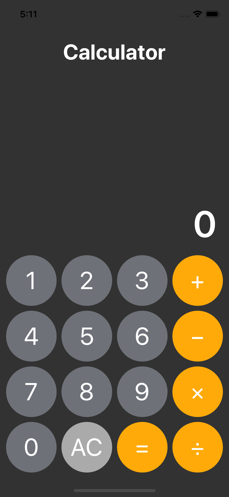

# Basic Calculator

## Description

- 기본적인 덧셈, 뺄셈, 곱셈, 나눗셈을 구현한 계산기 앱
- Code base AutoLayout 사용, MVC Pattern 적용



## MVC Pattern

- **View**(`NumberPad`-`CalculatorButton`)에서 받은 사용자 입력을 **Controller**가 delegate으로 받아서 **Model**(`Calculator`)을 update

- **Model**을 update한 결과를 display label에 표시하기 위해 **Controller**를 통해 **View**(`DisplayLabel`)을 update

  

## Implementation

- 연산을 위해 두 개의 연산자(`firstOperator`, `secondOperator`)와 두 개의 피연산자(`firstOperand`, `secondOperand`)를 사용
- 연산자 입력 시 이전에 입력된 연산자(`firstOperator`)로 두 피연산자를 더해서 `firstOperand`로 만들고, 입력된 연산자를 이용해 이어서 들어오는 값을 연산해 나가는 방식으로 구현

### Controller

- Communicate with **Model**
  - `update(operand:)` : Model(Calculator)의 `operator`를 update
  - `update(operator:)` : Model의 `operand`를 update
  - `clear()` : Model의 모든 `operator`와 `operand`를 초기화(update)
  - `display()` : Model에 View에 표시할 숫자를 요청
- Communicate with **View**
  - `setDelegate(_:)` : `NumberPad`에 포함된 모든 `CalculatorButton`에 delegate 설정
  - `text` : `DisPlayLabel`의 `text`를 Model로부터 받은 값을 update

### View

- `UIStackView`를 이용하여 계산기 NumberPad의 Auto Layout을 code base로 구현

  ```swift
  final class NumberPadView: UIStackView {
  
    // MARK: Initialize
    ...
    
    // NumberPad의 가로 네 줄을 세로 StackView로
    private func setupComponents() {
    	/// Create NumberPad Buttons
  		let stack1 = createHorizontalSet(items: ["1", "2", "3", "+"])
      let stack2 = createHorizontalSet(items: ["4", "5", "6", "−"])
      let stack3 = createHorizontalSet(items: ["7", "8", "9", "×"])
      let stack4 = createHorizontalSet(items: ["0", "AC", "=", "÷"])
          
  		/// Merge Four Horizontal Stacks with Vertical Axis Stack
      for view in [stack1, stack2, stack3, stack4] {
      	self.addArrangedSubview(view!)
      }
  	}
      
    // MARK: Methods
    func setDelegate(_ delegate: CalculatorButtonDelegate) {
        for horizontalStack in self.arrangedSubviews {
            for calcButton in (horizontalStack as! UIStackView).arrangedSubviews {
                (calcButton as! CalculatorButton).delegate = delegate
            }
        }
    }
  }
  ```

- `NumberPad`의 각 버튼을 누를 때 이벤트 callback을 **Delegate Pattern**으로 구현

  ```swift
  protocol CalculatorButtonDelegate: class {
  	func touched(_ sender: UIButton)
  }
  
  final class CalculatorButton: UIButton {  
    weak var delegate: CalculatorButtonDelegate?
   
    // MARK: Initialize
    
  	/// self.frame 초기화 시점에 맞춰 cornerRadius를 init이 아닌
  	// layoutSubviews에서 구현
  	override func layoutSubviews() {
    	super.layoutSubviews()
      self.layer.cornerRadius = self.frame.width / 2
    }
      
    // MARK: Action Delegate
    @objc private func buttonTouched(_ sender: UIButton) {
    	delegate?.touched(sender)
    }
  }
  ```

### Model

- `enum`을 사용하여 계산기 연산 구현

  ```swift
  enum Operator: String {
    case plus = "+"
    case minus = "−"
    case multiply = "×"
    case divide = "÷"
    case calculate = "="
    case none
          
    func operate(_ operand1: Double, _ operand2: Double) -> Double? {
    	switch self {
      case .plus:
      	return operand1 + operand2
      case .minus:
      	return operand1 - operand2
      case .multiply:
      	return operand1 * operand2
      case .divide:
      	guard operand2 > 0 else { return nil }
        return operand1 / operand2
      case .calculate, .none:
      	return nil
  		}
  	}
  }
  ```
