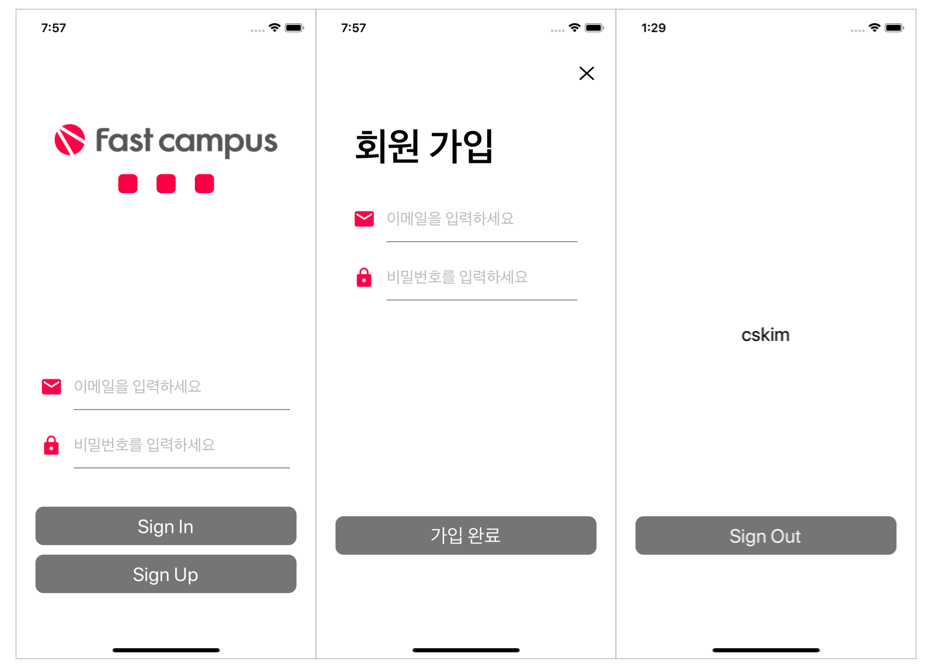

# Basic Login Page

## Description

- Code baee AutoLayout으로 로그인 및 회원가입 화면 구현

- `UserDefaults`를 활용한 자동 로그인 기능 구현

- MVC Pattern 적용

  

## Implementation

#### Class Design for MVC


#### Controller

- `SignInViewController` : 로그인 화면 관리
- `SignUpViewController` : 회원 가입 화면 관리
- `MainViewController` : 로그인 후 메인 페이지 관리

#### View

- `FormContainerView` : Email, Password를 위한 `FormTextField`를 갖는 container view
  - `canSignUp()` : 입력된 email, password로 회원 가입 가능 여부를 notify
  - `canSignIn()` : 입력된 email, password로 로그인 가능 여부를 notify
  - `fetch()` : 현재 입력된 email, password를 notify
  - `setTextFieldDelegate(_:)` : Container에 포함된 모든 `UITextField`의 delegate object 설정
- `SignContainerView` : 로그인 화면에서 SignIn, SignUp 버튼을 위한 `SignButton`을 갖는 container view
  - `setButtonDelegate(_:)` : Container에 포함된 모든 `UIButton`의 delegate object 설정
- 기타 `LogoView`, `DotView` 등 code base AutoLayout을 사용한 Custom UI

#### Model

- `UserDefaults`를 활용한 사용자 정보 관리

- Delegate Pattern을 이용하여 `SignButton`이 받는 사용자 입력에 대한 callback 처리

  ```swift
  // Sign Up : 구현할 delegate target을 다르게 하여 같은 함수가 다른 기능을 구현하도록 함
  
  extension SignUpViewController: SignButtonDelegate {
  	func signUpTouched() {
    	// View(Input Form)로부터 사용자가 입력한 email/password가 유효한지 확인
      guard inputForm.canSignUp(), let userInfo = inputForm.fetch() else { 
        return 
     	}
      // UserDefaults set - key: email, value: password
      UserDefaults.standard.set(userInfo.password, forKey: userInfo.email)
      dismiss(animated: true, completion: nil)
    }
  }
  
  extension SignInViewController: SignButtonDelegate { 
    func signUpTouched() {
    	let signUpVC = SignUpViewController()
      signUpVC.modalPresentationStyle = .fullScreen
      present(signUpVC, animated: true)
    }
  }
  
  // Sign In
  
  extension SignInViewController: SignButtonDelegate {
  	func signInTouched() {
    	guard inputForm.canSignIn(), let userInfo = inputForm.fetch() else { 
        return 
      }
          
      let mainVC = MainViewController()
      mainVC.modalPresentationStyle = .fullScreen
          
      // Login된 정보 저장
      UserDefaults.standard.set(true, forKey: UserInfoKey.isLogined)
      UserDefaults.standard.set(userInfo.email, forKey: UserInfoKey.loginedEmail)
      UserDefaults.standard.set(userInfo.password, forKey: UserInfoKey.loginedPassword)
          
      present(mainVC, animated: true)
    }
  }
  ```

### Auto Login

- 한번 로그인 하면 다음부터는 자동으로 로그인된 상태로 앱을 사용하도록 함

- `UserDefaults`에 로그인 했는지 여부(`isLogined`)를 저장

  ```swift
  @UIApplicationMain
  class AppDelegate: UIResponder, UIApplicationDelegate {
  	
    var window: UIWindow?
  
    func application(_ application: UIApplication, didFinishLaunchingWithOptions launchOptions: [UIApplication.LaunchOptionsKey: Any]?) -> Bool {
      window = UIWindow(frame: UIScreen.main.bounds)
      
  		// 이전에 로그인한 기록이 있는지에 따라 첫 화면을 다르게 설정
      if UserDefaults.standard.bool(forKey: UserInfoKey.isLogined) {
      	window?.rootViewController = MainViewController()
      } else {
        window?.rootViewController = SignInViewController()
      }
      window?.makeKeyAndVisible()
      return true
    }
  }
  ```

- `UserDefaults`에 현재 로그인한 email(`loginedEmail`), password(`loginedPassword`)를 저장

  ```swift
  func signInTouched() {
  	...
    
    // 현재 로그인하려는 사용자 정보 저장
    UserDefaults.standard.set(true, 
                              forKey: UserInfoKey.isLogined)
    UserDefaults.standard.set(userInfo.email, 
                              forKey: UserInfoKey.loginedEmail)
    UserDefaults.standard.set(userInfo.password, 
                              forKey: UserInfoKey.loginedPassword)
  
    ...
  }
  ```

  