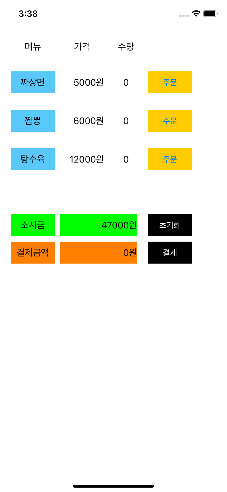

# Test1 - Simple Order

## Description

- 간단한 주문 및 결제 기능을 구현한 앱



## Implementation

- 결제 시 금액 상황에 따라 다른 알림창을 나타내기 위해 `UIAlertController`의 `title`, `message`, `UIAlertAction`를 **동적으로 구현**

- **내부함수**를 활용한 기능 추상화

  ```swift
  @objc private func pay(_ sender: UIButton) {
  	var title = "", message = ""
    var actions = [UIAlertAction]()
          
    /// 결제 할 수 없는 경우 초기화
    func failPayment(msg: String) {
    	title = "결제실패"
      message = msg
      let fail = UIAlertAction(title: "확인", style: .cancel)
      actions.append(fail)
  	}
          
  	/// 결제 가능한 경우 초기화
    func payment() {
    	title = "결제하기"
      message = "총 결제금액은 \(total)원 입니다."
      let ok = UIAlertAction(title: "확인", style: .default) { (action) in
      self.leftMoney -= self.total
      self.clearOrder()
  		}
      
  		let cancel = UIAlertAction(title: "취소", style: .cancel)
    	actions.append(contentsOf: [ok, cancel])
    }
          
  	if total == 0 {
  		// 결제 금액이 없는 경우 주문 필요
    	failPayment(msg: "먼저 주문을 해주세요")
    } else if leftMoney == 0 || leftMoney < total {
    	// 소지 금액이 결제 금액보다 적은 경우 또는 0인 경우 결제 불가
      failPayment(msg: "소지 금액이 부족합니다.")
  	} else {
    	// 나머지 경우 결제 가능
      payment()
  	}
          
  	let alert = UIAlertController(title: title, message: message, preferredStyle: .alert)
  	for action in actions {
    	alert.addAction(action)
  	}
          
  	present(alert, animated: true)
  }
  ```

- 프로퍼티 옵저버를 활용하여 수량 및 금액 값을 변경하면 `UILabel`의 `text`를 자동으로 변경하도록 구현함으로써 금액 계산과 `UILabel`의 `text` 표기를 구분

  ```swift
  // MARK: Count
  var jjajangCount = 0 {
  	didSet {
  		jjajangCountLabel.text = "\(jjajangCount)"
      total = (jjajangCount != 0) ? total + jjajangPrice : total
  	}
  }
  
  var jjambbongCount = 0 {
  	didSet {
    	jjambbongCountLabel.text = "\(jjambbongCount)"
     	total = (jjambbongCount != 0) ? total + jjambbongPrice : total
  	}
  }
      
  var tangsuCount = 0 {
  	didSet {
    	tangsuCountLabel.text = "\(tangsuCount)"
      total = (tangsuCount != 0) ? total + tangsuPrice : total
  	}
  }
  
  // MARK: Price
  
  var leftMoney = 70000 {
  	didSet {
    	moneyDisplayLabel.text = "\(leftMoney)원"
  	}
  }
      
  var total = 0 {
  	didSet {
    	paymentDisplayLabel.text = "\(total)원"
  	}
  }
  ```