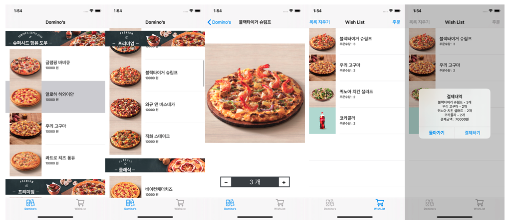

# Test2 - Domino Order

## Description

- UITableView와 UITabBarController를 활용한 피자 주문관리 앱



## Class Design adapting MVC Pattern

- MVC Pattern 적용
- Order Page
  - **Controller**에서 `UITableView`의 `dataSource` 구성 시 **Model**에 data를 요청하고(fetch), 그 응답을 **View**에 update


- Wish List Page

  - `DetailViewController`에서 주문 수량을 `WishListController`와 공유할 수 있도록 `class`를 사용하여 **Model**을 구성.
  - `WishListController`에서 `UITableView`의 `dataSource` 구성 시 **Model**에 data를 요청하고(fetch), 그 응답을 **View**에 update
  - `OrderControl`에서 **View**(`OrderControl`)를 통해 터치 입력을 받으면 `DetailViewController`에 데이터 갱신을 요청(update)하고, 갱신된 데이터를 받아서(fetch) **Controller**가 **View**에 변경된 data를 update

  

## Implementation

### Controller

- Communicate with **Model**
  - `numberOfCategory()` : Model에 카테고리의 개수를 요청
  - `numberOfProducts(at:)` : Model에 특정 카테고리에 있는 제품의 개수를 요청
  - `category(at:)` : Model에 특정 카테고리를 요청
  - `products(at:)` : Model에 특정 카테고리에 있는 제품들의 collection을 요청
  - `fetch()` : Model에 주문한 제품들의 collection과 개수를 요청
  - `orderedCount(of:)` : Model에 특정 제품의 주문한 개수를 요청
  - `perform(command:product:)` : Model에서 특정 제품의 주문 개수를 update
  - `removeAll()` : Model에 주문된 모든 제품을 삭제하도록 update

- Communicate with **View**
  - `updateContent(with:)` : `UITableView`에서 dequeue한 cell에 제품 정보를 update
  -  `setDelegate(_:)`
    : `OrderControl`에 있는 `OrderButton`의 `delegate`를 설정
  - `updateDisplay(count:)` : `OrderControl`에 있는 주문 수량을 표시하는 `UILabel`을 update

### Model

```swift
// MARK:- Raw Data

struct Menu { 
	let category: String
  let products: [Product]
}

struct Product {
  let name: String
  let price: Int
  let thumbnail: String
}

struct MenuData {
	// MARK: Interface
	func numberOfCategory() -> Int
	func category(at index: Int) -> String
	func numberOfProducts(at index: Int) -> Int
	func products(at index: Int) -> [Product]
}

// MARK:- User Data

typealias WishListData = (products: [Product], ordered: [Int])
class WishList {
  enum Command {
    case add, subtract
  }
  
  // MARK: Interface
  func fetch() -> WishListData
  func orderedCount(of newValue: Product) -> Int
  func perform(command: WishList.Command, product newValue: Product) -> Int
  func removeAll()
}
```

### View

- View에서 `OrderButton`의 사용자 입력에 따른 데이터 update를 위해 Delegate Pattern 적용

```swift
// MARK:- Custom Cell

class ProductCell: UITableViewCell {
  static let identifier = String(describing: ProductCell.self)
  
  // MARK: Interface
  func updateContent(with product: Product)
}

class WishCell: UITableViewCell {
  static let identifier = String(describing: WishCell.self)
  
  // MARK: Interface
  func updateContent(with product: Product)
}

// MARK:- Order Control

class OrderControl: UIStackView {
  private let addButton = OrderButton(type: .add)
	private let subButton = OrderButton(type: .subtract)
	private let displayLabel = OrderDisplayLabel()
  
  // MARK: Interface
  func setDelegate(_ delegate: OrderButtonDelegate)
  func updateDisplay(count: Int)
}

// MARK:- Order Button

protocol OrderButtonDelegate: class {
  func order(_ sender: UIButton)
}

class OrderButton: UIButton {
  weak var delegate: OrderButtonDelegate?
  
  // MARK:- Delegate Action
  @objc private func touched(_ sender: UIButton) {
    delegate?.order(sender)
  }
}
```